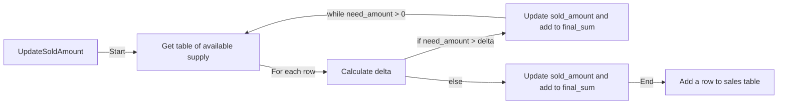

# HackNU

```mermaid
flowchart LR
    A[UpdateSoldAmount] -- Start --> B[Get table of available supply]
    B -- For each row --> C[Calculate delta]
    C -- if need_amount > delta --> D[Update sold_amount and add to final_sum]
    D -- while need_amount > 0 --> B
    C -- else --> E[Update sold_amount and add to final_sum]
    E -- End --> F[Add a row to sales table]
```